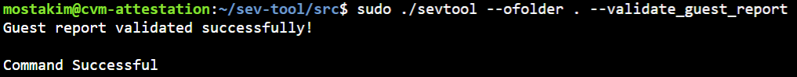
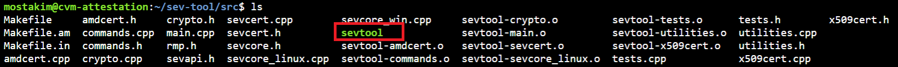
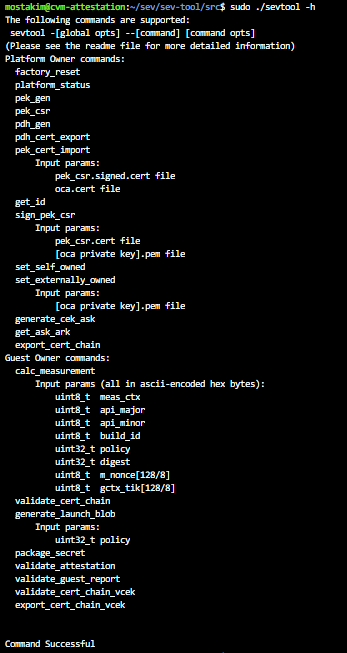
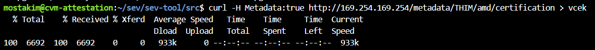
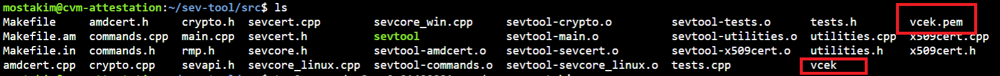
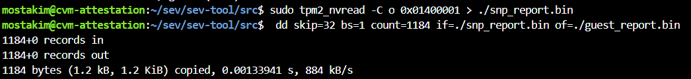
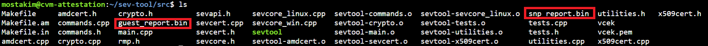

## AMD SEV_SNP Report
The AMD CPU may offer cryptographically signed evidence of SEV-SNP feature enabling through a SEV-SNP report. This is critical evidence in validating the VM's confidentiality.

To construct a VCEK (Versioned Chip Endorsement Key), the version numbers of all TCB components are coupled with a fused secret termed the Chip Endorsement Key in SEV-SNP. It is a private ECDSA key that is distinct to each AMD processor running a certain TCB version. This VCEK is used for SEV-SNP report signing.

[You can obtain the VCEK certificate by following the instructions here: Versioned Chip Endorsement Key (VCEK) Certificate and KDS Interface Specification (amd.com)](https://www.amd.com/system/files/TechDocs/57230.pdf)

If you don't trust MAA(Microsoft Azure Attestation) or the library you're requesting to install in my VM, but you do trust the underlying HCL firmware, the process for fetching and verifying raw AMD SEV-SNP reports on your own is explained below.

### Alternative 1
Either you can use the script ```amdsev.cpp``` using:
```
g++ amdsev.cpp -o amdsev
./amdsev
``` 
It will generate a folder with timestamp and provide an output like below through pipeline using the file inside timestamp folder.



### Alternative 2
Foloow the points to do it manually:

1. Install the AMD SEV-Tool utility following the instructions here: [GitHub – AMDESE/sev-tool: AMD SEV Tool](https://github.com/AMDESE/sev-tool), and contact AMD for support.





2. For cryptographic verification, install the tpm2-tss library, which is a widely used open source TPM software stack – all the relevant OS distribution instances supported by CVMs have associated instructions at the link below.
- https://github.com/tpm2-software/tpm2-tss/blob/master/INSTALL.md
(For Ubuntu OS, use newer instructions from Canonical site -
- https://packages.ubuntu.com/source/focal-updates/tpm2-tss. Download tpm2-tss zipped archive and follow instructions in INSTALL.md)
Install tpm2-tools ```sudo apt install tpm2-tools)```
Obtain the VCEK certificate by running the following command – it obtains the cert from a well-known IMDS endpoint:

```
curl -H Metadata:true http://169.254.169.254/metadata/THIM/amd/certification > vcek
cat ./vcek | jq -r '.vcekCert , .certificateChain' > ./vcek.pem
```




3. Extract the raw SNP report from the vTPM NVRAM (that was pre-generated by the HCL at boot) by executing the following command which will dump the report in binary form. Note that this is not a dynamically generated report.

```
sudo tpm2_nvread -C o 0x01400001 > ./snp_report.bin
dd skip=32 bs=1 count=1184 if=./snp_report.bin of=./guest_report.bin
```




Note: Once the VCEK cert and SNP report are available, the steps below can be done on any other trusted CVM or non-CVM machine. 

5. Use AMD SEV-Tool to parse the report (to obtain the information that SNP is enabled). Note: sevtool binary is in the /src folder.
```
sudo ./sevtool --ofolder <location of vcek.pem & guest_report.bin> --validate_guest_report
```

If you see the above output, it means that the SNP report is valid, and that HCL has cryptographically verified that it is running on a genuine AMD processor and that SNP is enabled for confidentiality on this processor.

It is important to note that the SNP report only certifies/measures the HCL (Microsoft firmware)+ UEFI binary. You will not be able to generate arbitrary SNP reports by directly calling hardware APIs